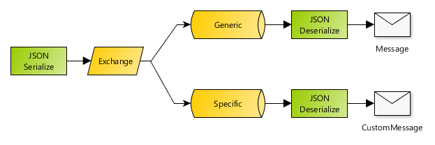

# Spring Boot AMQP messaging example with RabbitMQ

This is a simple Spring Boot app that shows how to easily configure RabbitMQ with AMQP for producing and consuming messages in default format (java serialized) and JSON.

In this sample project, each message is sent as JSON and then decoded:

1. on a queue as a generic `Message` object,
2. and on a different queue as the original specific class (with JSON deserialization).

Note that you need a RabbitMQ server instance running locally to be able to run this application. You can use the included `docker-compose.yml` file to start a new server using Docker: `docker-compose up -d`

I recommend you to have a look at the full explanation of this code, you can find it
[on The Practical Developer site](https://thepracticaldeveloper.com/produce-and-consume-json-messages-with-spring-boot-amqp/).

If you want to learn more about microservices, RabbitMQ, Spring Boot Autoconfiguration, event-driven, and microservice architecture patterns, [have a look at my book](https://amzn.to/3nADn4q).
